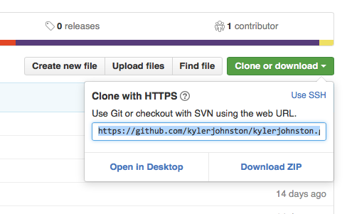

Another Static Flask Blog
=========================

Description
-----------

`another-static-flask-blog` is a static HTML blog generator written in Python and [Flask](http://flask.pocoo.org). Its design was inspired by blog posts [from nicolas.perriault.net](https://nicolas.perriault.net/code/2012/dead-easy-yet-powerful-static-website-generator-with-flask/), [James Harding](http://www.jamesharding.ca/posts/simple-static-markdown-blog-in-flask/), and [Charles Leifer](http://charlesleifer.com/blog/how-to-make-a-flask-blog-in-one-hour-or-less/)), Miguel Grinberg’s excellent book [*Flask Web Development*](http://flaskbook.com), and my own experience with other static blog generators, like [Jekyll](http://jekyllrb.com) and [Pelican](http://blog.getpelican.com). 

**This is not intended for use as a template**. This repository reflects the code I use to build and publish my own blog, [kylerjohnston.com](http://kylerjohnston.com); as such it’s full of my own content, configurations, and Jinja2 templates. I’m publishing this as another example (in addition to the aforementioned blog posts) of how a static blog can be written in Flask. Use it for ideas. Fork it if you want and build off it! Just be aware you’ll have to dig around in the configurations and templates a bit to set things up for your particular needs.

Installation
------------

### Dependencies

- Python 3

For a list of Python dependencies, see `requirements.txt`.

### Installation instructions

Installing the application involves cloning the repository, setting up a Python 3 virtual environment, and installing the Python dependencies into the virtual environment. Instructions below assume the user is familiar with using the command line in a Linux or OS X environment.

1. You will first need to install Python 3. If Python 3 is already installed, skip to step 2.

    You can check if Python 3 is already installed by running the following:
    
    ```
    $ python3
    ```

    If you get an error, you will need to install Python 3. You can [download Python 3](https://www.python.org/downloads/) or install it using your operating system's package management system.


2. Once Python 3 is installed, you will need to clone the repository.

    ```
    $ git clone https://github.com/kylerjohnston/another-static-flask-blog.git
    ```

    This copies all the files from this Github repository to a local directory on your computer.

3. Next, you will need to change into the newly cloned directory and create a Python 3 virtual environment.

    ```
    $ cd another-static-flask-blog/
    $ python3 -m venv venv/
    ```

    This will create a new directory `venv/`.

4. Activate the virtual environment created in the last step.

    ```
    $ source venv/bin/activate
    ```

    The command prompt should now look something like `(venv) $`, indicating that the virtual environment is activated. Typing `python` at the command line will now launch the virtual environment's Python shell, not the global Python shell. If you need to leave the virtual environment, use the `deactivate` command.

5. Next, install `another-static-flask-blog`'s Python dependencies into the virtual environment. Type:

    ```
    (venv) $ pip install -r requirements.txt
    ```

    This will install all of the Python libraries listed in the `requirements.txt` file.

Usage
-----

### Managing content

#### Blog posts and About page

Most of the content on the site is parsed from Markdown files and rendered into HTML using Jinja2 templates. By default, these Markdown files are stored in `app/content/`.

Markdown content files can contain the following YAML header variables:

| Variable    | Description                                                   |
|-------------|---------------------------------------------------------------|
| `title`     | The title of the page. For blog posts, this will appear in the `<title>` tag and as the title of the post.|
| `date`      | The date will appear under the title of blog posts. Must be in the format `%d %B %Y`, e.g. `01 January 2016`.|
| `tags`        | A list of tags for the blog post.                           |
| `description` | Will be used as the meta description for the page.          |

YAML variables should go at the top of the document and be separated from the content by a single new line. A blog post, for example, looks like:

```
title: My blog post
date: 01 January 2016
tags:
  - blogging
  - dogs
description: My blog post about dogs

Dogs are great. There are many dogs in the world. I have a dog.
```

To make a new blog post, simply save a Markdown file with a `.md` extension to `app/content/posts/`. Posts appear on the blog page organized in reverse chronological order.

Posts saved to `app/content/drafts/` can be seen at http://127.0.0.1:5000/drafts/ when running the server if the `FLASK_CONFIG` environment variable is set to `drafting`. To enable draft visibility, type in the terminal:

```
(venv) $ export FLASK_CONFIG=drafting
```

The site also has an about page which is generated from a Markdown file. To change the content of the about page, edit `app/content/about.md`.

#### Portfolio page

The portfolio page is not generated from Markdown at this time. Rather, the content is hard-coded into a Jinja2 template. To edit the content of the portfolio page, you will need to edit `app/templates/resume.html`.

### Running a server

To run a local server, change into the `another-static-flask-blog/` directory, activate the virtual environment, and run the command:

```
(venv) $ ./manage.py runserver
```

You can view the site at http://127.0.0.1:5000.

### Exporting a static website

To export the site to static HTML files, change into the `another-static-flask-blog/` directory, activate the virtual environment, and run the command:

```
(venv) $ ./manage.py build
```

This will create a new directory, `app/build/`, with your static site.

#### Publishing to Github Pages

[Github Pages](https://pages.github.com) allows users to host static web pages for free.

1. The first step is to create a new Github repository for your site. Log in to your Github account and create a new repository with your desired Github Pages URL. For example, to host my site I created a repository called [kylerjohnston.github.io](https://github.com/kylerjohnston/kylerjohnston.github.io).

2. After running `./manage.py build`, change into the `build/` directory.

    ```
    (venv) $ ./manage.py build
    (venv) $ cd app/build/
    ```

3. Initialize the `build/` directory as a new git repository.

    ```
    (venv) $ git init
    ```

4. Add and commit all the files to the new local repository.

    ```
    (venv) $ git add .
    (venv) $ git commit -m "First build of new website"
    ```

5. Copy the remote URL of the Github repository you created for your site.

    

6. Set the Github repository as a new remote repository.

    ```
    (venv) $ git remote add origin [remote url for Github repository]
    ```

7. Push the repository to Github.

    ```
    (venv) $ git push origin master
    ```

8. To publish changes to your site in the future, simply run `./manage.py build` from the `another-static-flask-blog/` directory, then change into the `build/` directory and add, commit, and push the new changes to Github.

    ```
    (venv) $ ./manage.py build
    (venv) $ cd app/build
    (venv) $ git add .
    (venv) $ git commit -m "Adds a new blog post"
    (venv) $ git push origin master
    ```

Configuration
-------------

### Flask configuration

Configuration values for Flask, Frozen-Flask, and Flask-FlatPages can be changed in `config.py`. See [Flask's documentation](http://flask.pocoo.org/docs/0.11/config/), [Frozen-Flask's documentation](http://pythonhosted.org/Frozen-Flask/), and [Flask-FlatPages' documentation](https://pythonhosted.org/Flask-FlatPages/) for more information.

### Blog configuration

When the `/blog/` URL is requested, `another-static-flask-blog` creates a new instance of the `Blog` class which aggregates the `Page` objects created by [Flask-FlatPages](https://pythonhosted.org/Flask-FlatPages/) for all Markdown files in `app/content/posts/` and separates them into pages. By default, `another-static-flask-blog` will show five blog posts per page. This value can be change by modifying the `get_pages` function in `app/blog.py`.

### Styling

Pages are rendered using [Jinja2](http://jinja.pocoo.org) templates found in `app/templates/`. `app/main/views.py` configures the routing for the app and shows which template is rendered by each route.

SCSS files are in `app/static/scss/`. SCSS compilation settings can be modified in `app/asset_bundle.py`.

JavaScript files are in `app/static/js/`.

License
-------

The MIT License (MIT)
Copyright (c) 2016 Kyle Johnston <kylerjohnston@gmail.com>

Permission is hereby granted, free of charge, to any person obtaining a copy of this software and associated documentation files (the "Software"), to deal in the Software without restriction, including without limitation the rights to use, copy, modify, merge, publish, distribute, sublicense, and/or sell copies of the Software, and to permit persons to whom the Software is furnished to do so, subject to the following conditions:

The above copyright notice and this permission notice shall be included in all copies or substantial portions of the Software.

THE SOFTWARE IS PROVIDED "AS IS", WITHOUT WARRANTY OF ANY KIND, EXPRESS OR IMPLIED, INCLUDING BUT NOT LIMITED TO THE WARRANTIES OF MERCHANTABILITY, FITNESS FOR A PARTICULAR PURPOSE AND NONINFRINGEMENT. IN NO EVENT SHALL THE AUTHORS OR COPYRIGHT HOLDERS BE LIABLE FOR ANY CLAIM, DAMAGES OR OTHER LIABILITY, WHETHER IN AN ACTION OF CONTRACT, TORT OR OTHERWISE, ARISING FROM, OUT OF OR IN CONNECTION WITH THE SOFTWARE OR THE USE OR OTHER DEALINGS IN THE SOFTWARE.
